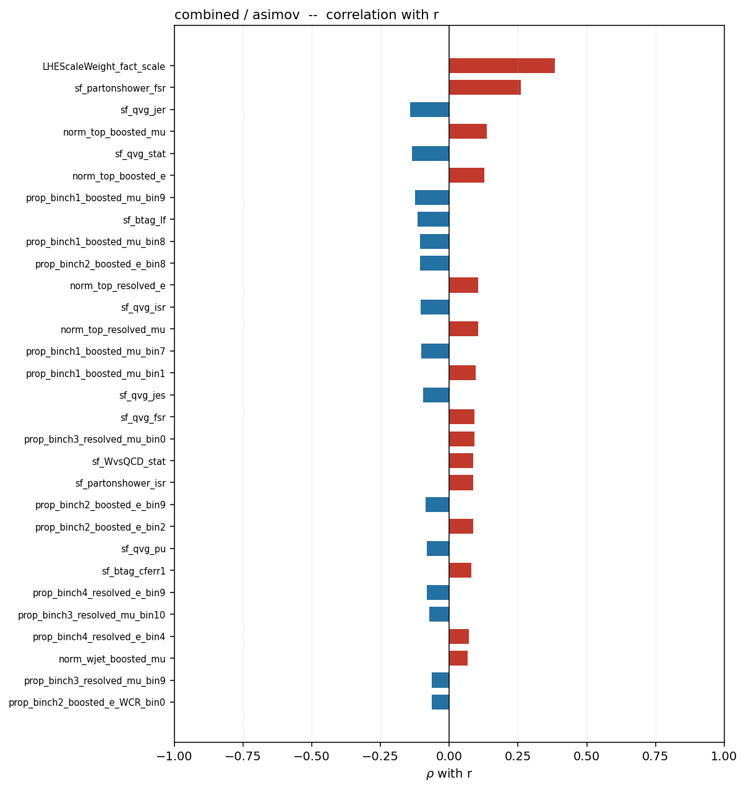
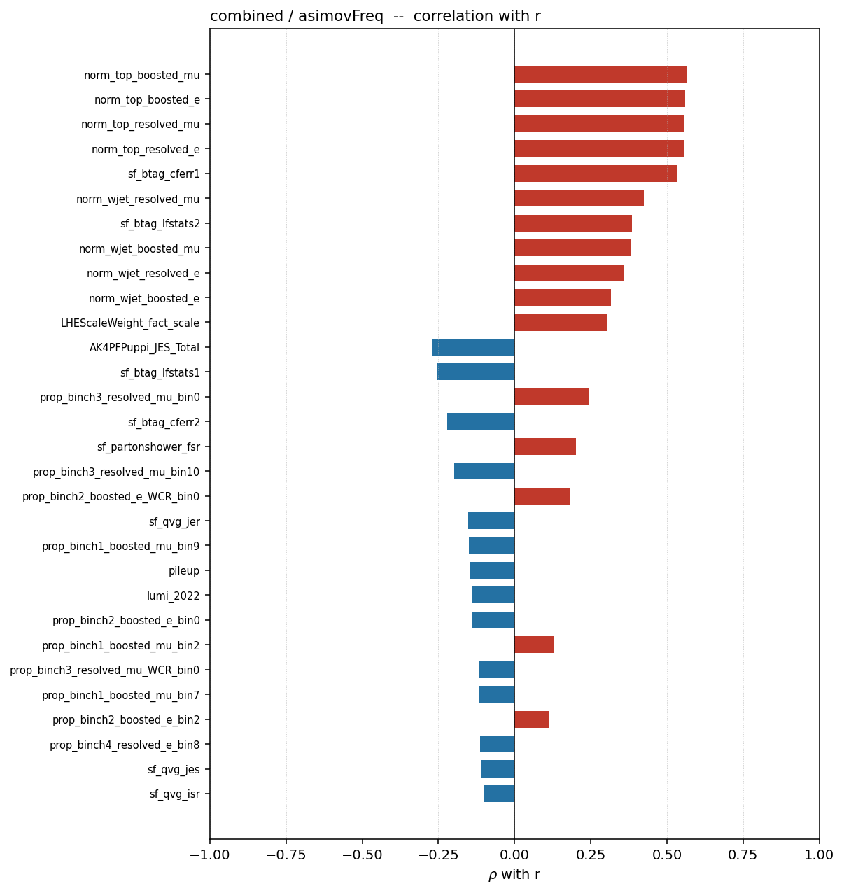
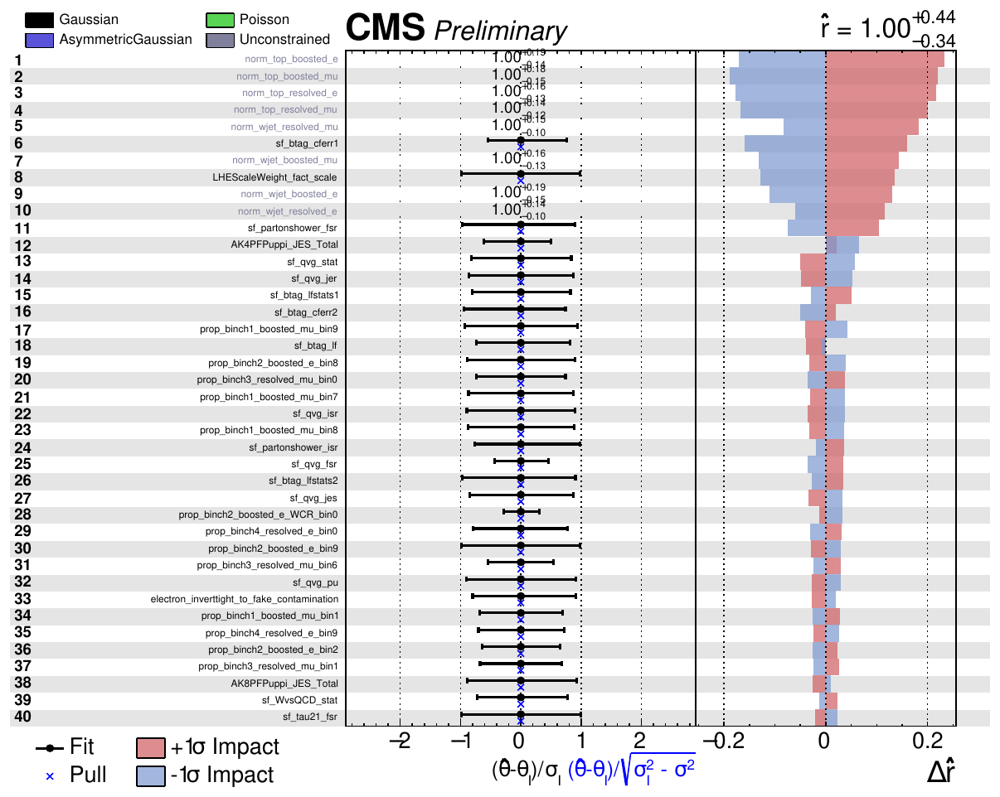
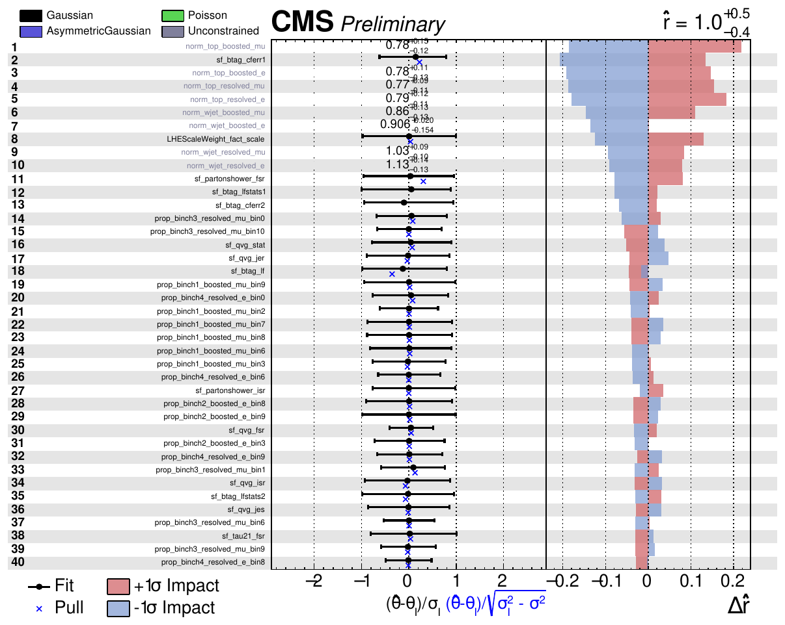
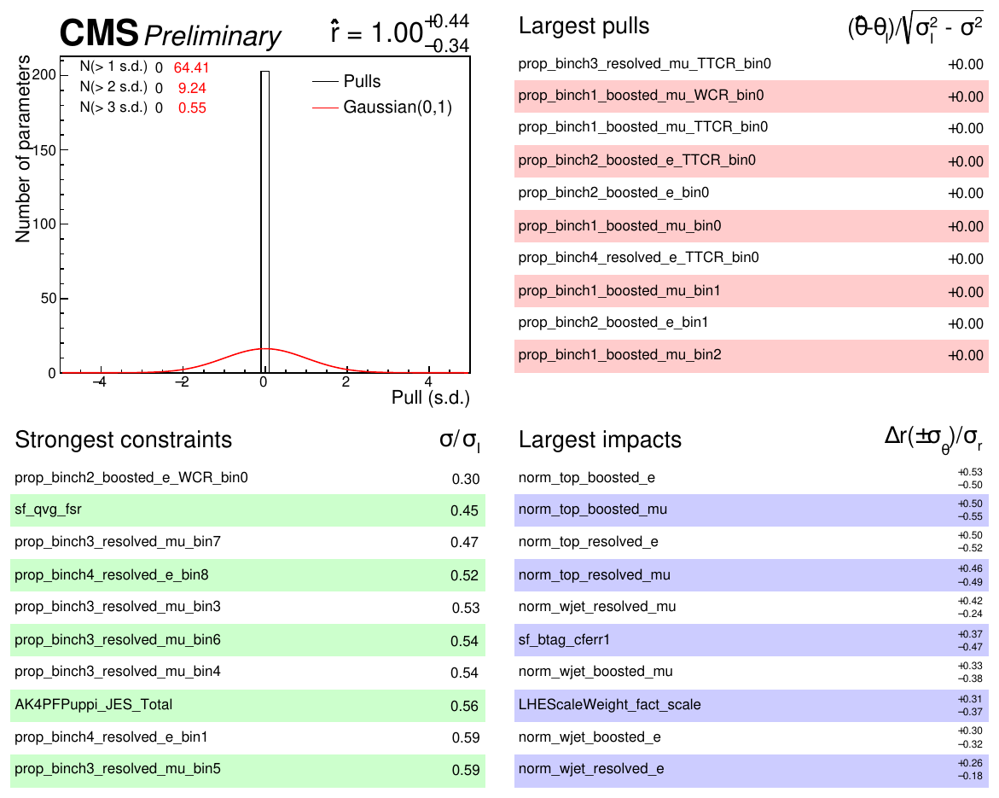
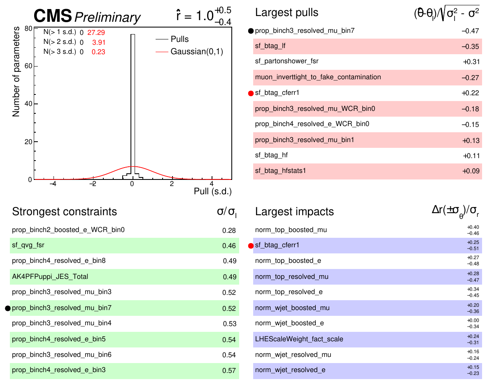
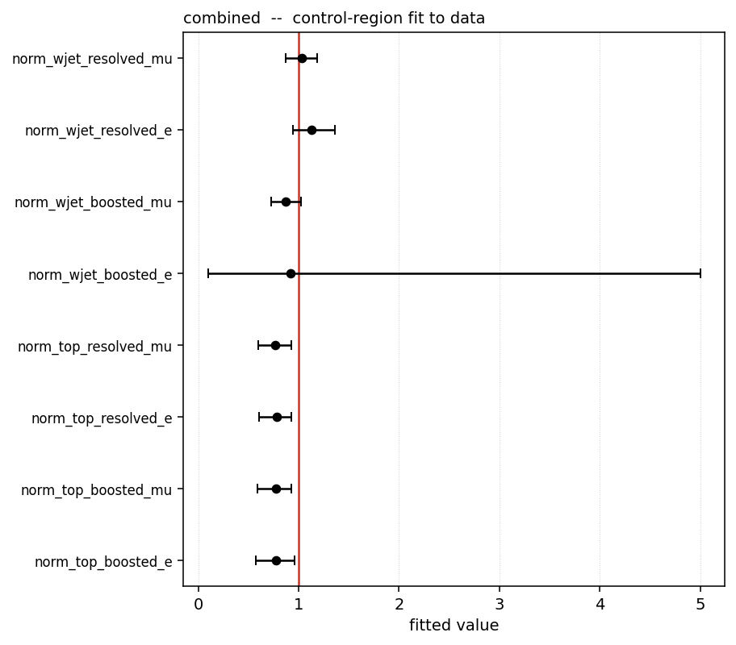

<!-- _class: title -->
<!-- _paginate: false -->

# WV Run-3 VBS — combined-card diagnostics

## `asimov` vs `asimovFreq`, blind

Combine v10.0.2 — CMSSW_14_1_0_pre4

Full output: <code>/eos/user/m/mpresill/www/VBS/wv-run3</code> — code: <code>CombineUtils/generic-diagnostics</code>

---

# Results — combined

| mode | Z | p | $\hat r$ | $\sigma_{\rm tot}$ | $\sigma_{\rm stat}$ | $\sigma_{\rm syst}$ | dominant syst. | status | covQual |
|---|---|---|---|---|---|---|---|---|---|
| `asimov` | 3.747 | $8.9\times10^{-5}$ | $+1.0000$ | 0.4019 | 0.1905 | 0.3555 | btag | 0 | 2 |
| `asimovFreq` | 2.915 | $1.8\times10^{-3}$ | $+1.0002$ | 0.4828 | 0.2385 | 0.4198 | MC_stat | 0 | 3 |

**Uncertainty breakdown by group** (no plot, numbers only — quadrature-sum totals, not stat-only-subtraction quoted above):

`asimov` — btag 55.1%, bkg_norm 55.0%, theory 41.8%, MC_stat 41.5%, V_tagging 40.4%, JES_JER 10.5%, fakes 7.6%, pileup_lumi 5.4%, leptons 5.0%

`asimovFreq` — MC_stat 49.5%, bkg_norm 46.4%, btag 45.7%, V_tagging 43.9%, theory 36.3%, JES_JER 27.7%, leptons 25.7%, fakes 16.3%, pileup_lumi 6.2%

---

# Flagged pathologies — combined

Counts, not verdicts — green means nothing was flagged.

| mode | ident. Up/Down | one-sided | large lnN | tmpl errors | tmpl warnings | prunable | \|pull\|>1 | over-constr. | inflated |
|---|---|---|---|---|---|---|---|---|---|
| `asimov` | 46 | 32 | 25 | **0** | 149 | 12 | 7 | 0 | **0** |
| `asimovFreq` | 46 | 32 | 25 | **0** | 149 | 12 | 1 | 4 | — |

`asimov` also reports **non-zero pull on Asimov = 0**, as required for a pre-fit Asimov (not applicable to `asimovFreq`). `minimiser stable` / `CCC p` / `GoF` are not populated per-mode on the summary page — see the `crfit`/`gof` stage pages directly.

---

<!-- _class: fig -->

# Nuisance correlation with $r$ — `asimov`

---

<!-- _class: fig -->

# Nuisance correlation with $r$ — `asimovFreq`

Same leading rate parameters as `asimov`, plus `sf_btag_cferr1`/`sf_btag_lfstats2` rising once nuisances are fit to data.

---

<!-- _class: fig -->

# Impacts — combined, `asimov` (page 1 of 6)

211/211 per-parameter fits usable. Pulls identically zero, as required for a pre-fit Asimov.

---

<!-- _class: fig -->

# Impacts — combined, `asimovFreq` (page 1 of 6)

211/211 fits usable. Pulls now non-zero — the ranking is built at the nuisance values the data prefers.

---

# Impact summaries side by side

### `asimov`

### `asimovFreq`

---

<!-- _class: fig -->

# Control-region fit to real data

`combine -M MultiDimFit --algo singles`, observed data, signal regions masked via `--setParameters mask_SR=1,...` and `r` frozen to 0 — the one stage here that touches real data, and only in the control regions.
