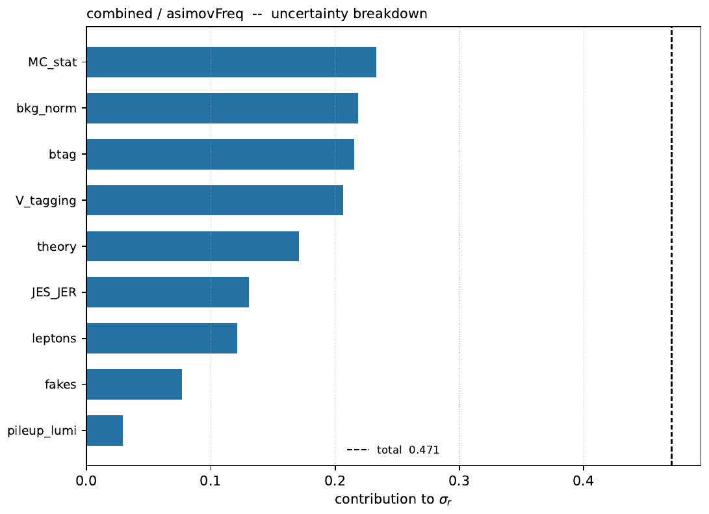
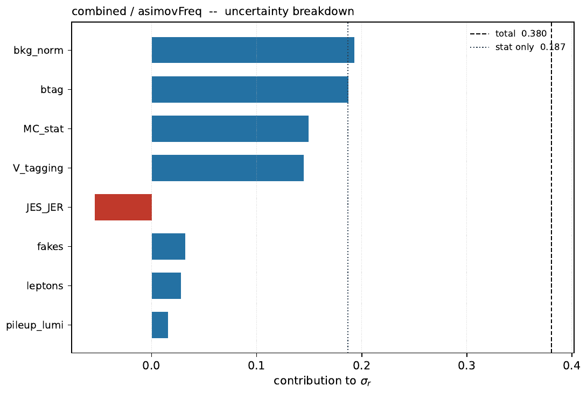

<!-- _class: title -->
<!-- _paginate: false -->

# WV Run-3 VBS — the `asimovFreq` snapshot fix

## Re-run of the combined card after correcting the post-fit Asimov

Supersedes the `asimovFreq` numbers in the original `wv-run3` deck (2026-08-19)

Combine v10.0.2 — CMSSW_14_1_0_pre4

Full output: <code>/eos/user/m/mpresill/www/VBS/wv-run3</code> — code: <code>CombineUtils/generic-diagnostics</code>

---

# What was wrong

`GenerateOnly -t -1 --toysFrequentist` writes **two** objects into the toy file: `toys/toy_asimov` (the dataset) and `toys/toy_asimov_snapshot` (the global observables — the auxiliary measurements — moved to the same post-fit values the dataset was built at).

`--toysFrequentist` must be repeated on **every command that reads the file**. Combine only loads the snapshot when that flag is given again on the reading side. Every downstream `asimovFreq` command in the pipeline (significance, limits, fitdiag, scan, breakdown, impacts) was missing it.

**Effect:** the dataset came back correctly, but the global observables stayed at their nominal values. The constraint terms then pulled every nuisance back towards zero while the dataset said otherwise — the fit no longer returned $r=1$, and every uncertainty, significance and impact derived from it was quietly wrong. Not a crash, not a warning: a self-consistent-looking but incorrect Asimov.

**Fix:** `lib/common.sh::ensure_toy_dataset` now appends the same `--toysFrequentist` flag it used to *build* the file to `DATA_OPTS` on every read, and the freshness check (`older_than_workspace`) was extended to also catch a snapshot fit that predates the dataset it was fit to.

---

# Combined card — before vs after

| | before (buggy) | after (fixed) |
|---|---|---|
| $\hat r$ | $0.998^{+0.406}_{-0.357}$ | $1.000^{+0.538}_{-0.403}$ |
| significance | 3.85 $\sigma$ | **2.91** $\sigma$ |
| local $p$ | $5.9\times10^{-5}$ | $1.78\times10^{-3}$ |
| $\sigma_{\mathrm{tot}}$ | 0.380 | 0.471 |
| covQual | 3 | 3 (accurate) |
| median expected limit | — | $r < 0.690$ |

**The corrected number is materially different, not a rounding change.** The buggy run understated $\sigma_r$ by ~20% because the nuisance constraints were anchored to their nominal (not post-fit) values, making the fit look artificially tighter. **2.91$\sigma$ is the number to quote for `asimovFreq`, not 3.85$\sigma$.**

The `asimov` (pre-fit) mode did not use `--toysFrequentist` at all and is **unaffected** — its 3.74$\sigma$ / $1.000^{+0.440}_{-0.344}$ from the original deck still stands.

---

<!-- _class: fig -->

# Impact ranking — buggy vs fixed

### before (buggy)

### after (fixed)

**The ranking itself is stable** — the same rate parameters and `sf_btag_cferr1` lead in both — but every $\Delta r$ is larger after the fix, consistent with the wider $\sigma_{\mathrm{tot}}$.

---

<!-- _class: fig -->

# Impacts — combined, `asimovFreq` (fixed), page 1 of 6

211/211 per-parameter fits usable. Pulls now reflect the correct post-fit nuisance values.

---

# Where the uncertainty comes from (fixed)

after (fixed)

before (buggy)

| group | $\sigma$ frozen | contribution | % of total |
|---|---|---|---|
| MC_stat | 0.4089 | 0.2331 | 49.5% |
| bkg_norm | 0.4170 | 0.2184 | 46.4% |
| btag | 0.4186 | 0.2153 | 45.7% |
| V_tagging | 0.4229 | 0.2066 | 43.9% |
| theory | 0.4387 | 0.1707 | 36.3% |
| JES_JER | 0.4523 | 0.1304 | 27.7% |
| leptons | 0.4549 | 0.1211 | 25.7% |
| fakes | 0.4644 | 0.0766 | 16.3% |
| pileup_lumi | 0.4698 | 0.0291 | 6.2% |

**All nine groups now converge with a positive contribution** — no more of the negative/failed subtractions that made the original breakdown untrustworthy. Ordering is unchanged: MC stat and background normalisation still dominate.

---

# Takeaways

## What changed
- **Quote 2.91$\sigma$ / $r = 1.000^{+0.538}_{-0.403}$ for `asimovFreq`, not the 3.85$\sigma$ in the original deck.** The `asimov` (pre-fit) number is untouched.
- The `asimov` vs `asimovFreq` agreement claimed in the original deck ("the two modes agree to 3%: the card is stable") **no longer holds** — they now differ by ~0.8$\sigma$. That gap is real: it is the effect of fitting nuisances to the (blind) SR pseudo-data plus the real CR data before building the Asimov, and is expected to shrink once the fit-quality issues below are addressed.
- The group breakdown is now trustworthy end to end — every `--freezeNuisanceGroups` fit converged, so the caveat in the original deck about dropping the group table no longer applies.

## Still open (unchanged from the original deck)
1. Fix the PDF replica treatment (still overestimates by $\sqrt{100}=10$).
2. Chase the one-sided `AK4PFPuppi_JES_Total` impact in `resolved_e`.
3. Understand the coherent ~20% top-normalisation pull seen in the CR-only fit to data.

Only the **combined** card was re-run under the fix; `boosted_e/mu` and `resolved_e/mu` in the original deck were driven by the same buggy `asimovFreq` reading path and should be re-run before being quoted again.

