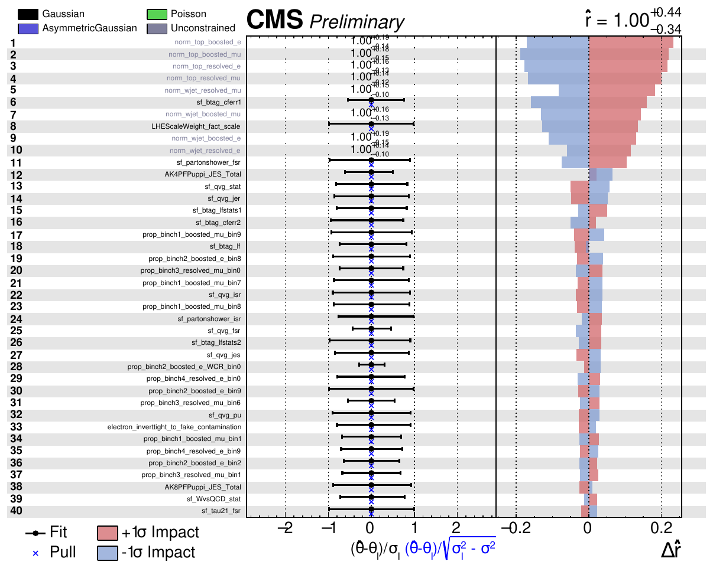
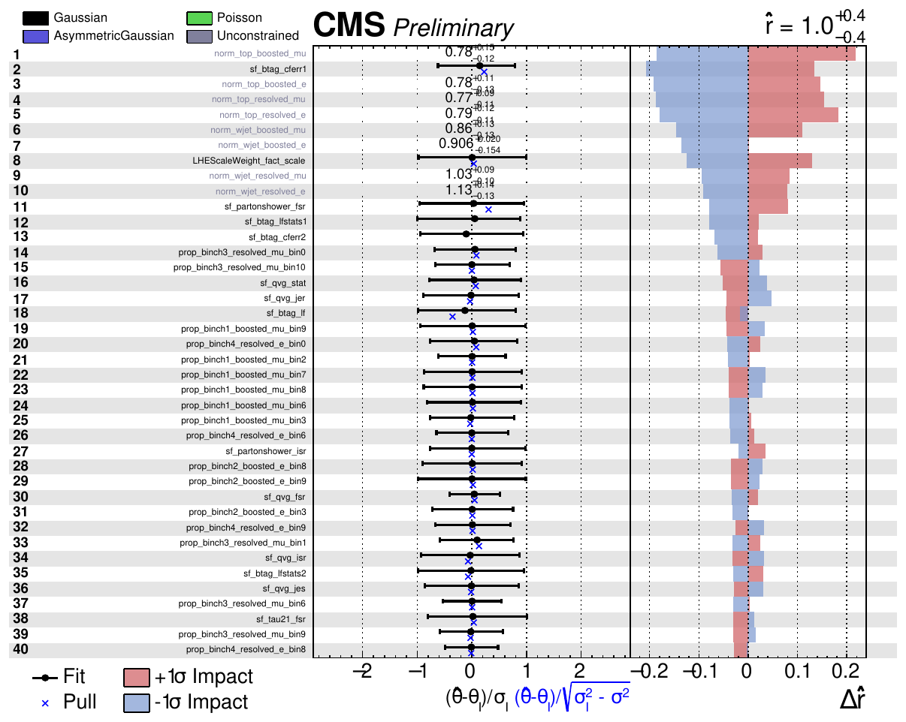
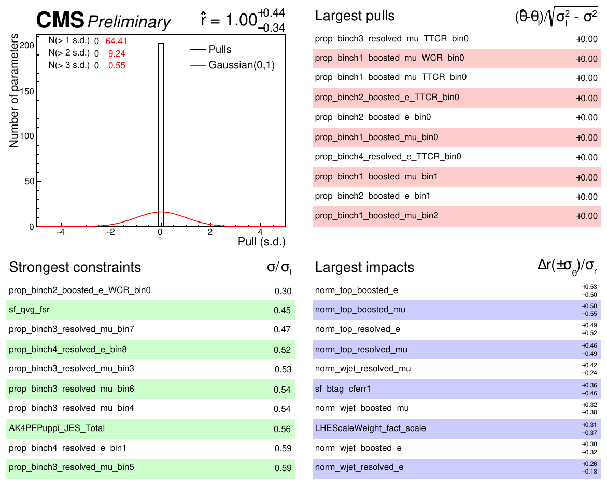
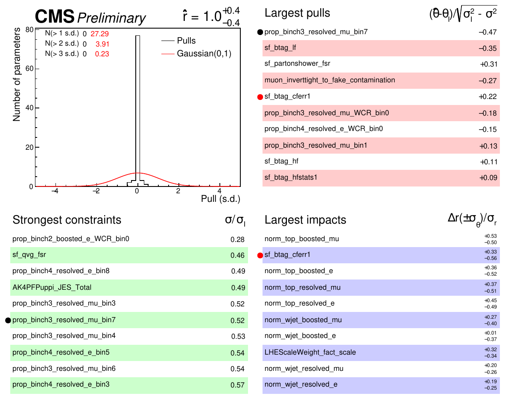
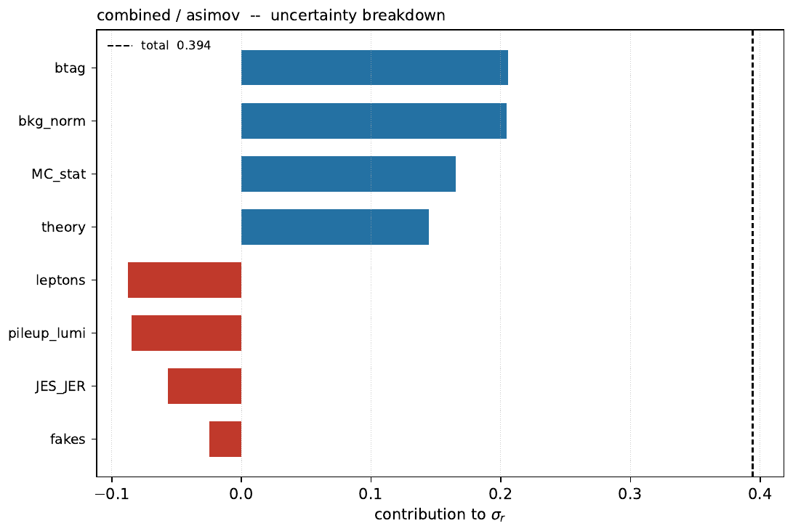

<!-- _class: title -->
<!-- _paginate: false -->

# WV Run-3 VBS — Combine diagnostics

## Blind Asimov validation of the `merged_offset_cat_v8` datacards

5 cards (`boosted_e/mu`, `resolved_e/mu`, `combined`) &nbsp;·&nbsp; 12 channels &nbsp;·&nbsp; 18 processes &nbsp;·&nbsp; 153 nuisances

Combine v10.0.2 — CMSSW_14_1_0_pre4

Full output: <code>/eos/user/m/mpresill/www/VBS/wv-run3</code> — code: <code>CombineUtils/generic-diagnostics</code>

---

# What was run, and why nothing is unblinded

## Two Asimov flavours

**`asimov`** — `-t -1`, pre-fit Asimov
Nuisances at their **prior** values; every pull is 0 by construction. Tests the *design* of the card.

**`asimovFreq`** — `-t -1 --toysFrequentist`
Asimov built at the **post-fit-to-data** nuisance values. Tests the card *as the data will actually constrain it*.

Stages: `validate · workspace · significance · fitdiag · nuisances · scan · breakdown · impacts · crfit`

## The signal regions really are blind

`data_obs` in all 10 SR bins is **non-integer** and carries **exactly zero bin errors**; the CRs hold plain integer counts with $\sqrt{N}$ errors.

Non-integer content with no errors cannot be an observed event count → the SRs contain a <b>pseudo-dataset</b>, not data.

Only **`crfit`** touches observed data, and only with the SRs masked and $r$ frozen to 0.

---

# Signal strength and significance

## Combined

| | `asimov` | `asimovFreq` |
|---|---|---|
| $\hat r$ | $1.000^{+0.440}_{-0.344}$ | $0.998^{+0.406}_{-0.357}$ |
| significance | **3.74** $\sigma$ | **3.85** $\sigma$ |
| local $p$ | $9.0\times10^{-5}$ | $5.9\times10^{-5}$ |
| $\sigma_{\mathrm{tot}}$ | 0.394 | 0.380 |
| $\sigma_{\mathrm{stat}}$ | *fit failed* | 0.187 |
| $\sigma_{\mathrm{syst}}$ | — | 0.331 |
| covQual | 2 | **3** |

## Per category (expected, $r=1$)

| card | `asimov` | `asimovFreq` |
|---|---|---|
| boosted_e | 2.59 | 2.74 |
| boosted_mu | 2.58 | 2.71 |
| resolved_e | 1.02 | 0.93 |
| resolved_mu | 1.00 | 0.85 |
| **combined** | **3.74** | **3.85** |

Quadrature sum of the four = 3.93 vs 3.74 combined: the ~5% loss is the price of the <b>correlated</b> rate parameters and b-tag systematics shared across categories. The combination behaves sensibly.

The two modes agree to 3%: **the card is stable** against where the Asimov is generated.

---

<!-- _class: fig -->

# Impacts — combined, `asimov` (page 1 of 6)

211/211 per-parameter fits usable. Pulls identically zero, as required for a pre-fit Asimov.

---

<!-- _class: fig -->

# Impacts — combined, `asimovFreq` (page 1 of 6)

211/211 fits usable. Pulls now non-zero — the ranking is built at the nuisance values the data prefers.

---

# Impact summaries side by side

### `asimov`

### `asimovFreq`

**Both modes: no parameter with $|{\rm pull}|>1$, none with a large impact and a constraint $<0.5$.**
The eight unconstrained `norm_top_*` / `norm_wjet_*` rate parameters own the top of the ranking (0.09–0.23 in $\Delta r$), followed by `sf_btag_cferr1` and `LHEScaleWeight_fact_scale`. **`sf_btag_cferr1` climbs to #2 in `asimovFreq`** ($\Delta r = 0.21$, pull $+0.15$) — the single constrained nuisance worth watching.

---

# Where the uncertainty comes from

`asimov`

`asimovFreq`

Ordering is consistent: **background normalisation ≈ b-tagging > MC statistics > theory / V-tagging**, each ~40–50% of the total.

<b>Caveat — the group breakdown is not trustworthy as it stands.</b> Several <code>--freezeNuisanceGroups</code> fits returned <i>"No valid low-error found"</i> and were dropped: <code>V_tagging</code> is missing from <code>asimov</code>, <code>theory</code> from <code>asimovFreq</code>, and the <code>asimov</code> stat-only fit failed outright. Four groups even come out with a <b>negative</b> contribution (frozen fit <i>wider</i> than the total), which is unphysical. Quote the stat-only subtraction ($\sigma_{\rm syst}=0.331$ from <code>asimovFreq</code>), not the group table, until the scan ranges are widened.

---

# Boosted vs resolved — two different analyses

## Boosted ($\approx 2.6\sigma$ each)
Systematics-driven and well behaved.
1. `norm_top_boosted_*` — 0.25–0.33
2. `sf_btag_cferr1` — 0.25–0.28
3. `norm_wjet_boosted_*` — 0.17–0.20
4. `LHEScaleWeight_fact_scale` — 0.13

Same ranking in both modes → robust.

## Resolved ($\approx 1.0\sigma$ each)
**MC-statistics-driven**, and fragile.
1. `prop_bin*` MC-stat — up to 0.48
2. `AK4PFPuppi_JES_Total` — **0.75** in `resolved_e`/`asimov`
3. `sf_qvg_jer/jes` — 0.29–0.32

<b>Two things to look at in resolved.</b> (1) <code>AK4PFPuppi_JES_Total</code> in <code>resolved_e</code> is violently <b>one-sided</b>: $\Delta r = -0.10 / +0.75$, and it shrinks to $+0.47$ in <code>asimovFreq</code>. A 75%-of-$r$ one-sided impact is a template problem, not a measurement. (2) Several <code>prop_bin</code> parameters in the last bins carry impacts of 0.33–0.48 — those bins are too thinly populated to be used as they are; consider rebinning the tail.

---

# PDF uncertainties do not follow the PDF4LHC prescription

The card carries **100 shape nuisances** `LHEPdfWeight_pdf_1…100` plus `LHEPdfWeight_alpha_S` — that is one nuisance **per NNPDF Monte-Carlo replica**, each `Down` an exact mirror of its `Up`.

### What the card does
100 replicas as **independent** Gaussians
→ they add in quadrature:
**2.29%** on the VBS yield (boosted_mu SR)

### What PDF4LHC prescribes
For an MC-replica set the uncertainty is the **RMS over replicas**:
**0.23%**

The current treatment overestimates the PDF uncertainty by a factor $\sqrt{100} = 10$, and spends <b>101 of the 211 impact fits</b> (~half the CPU) on it.

**Fix:** collapse the replicas into a single RMS shape nuisance, or convert to a Hessian representation (PDF4LHC21, 30 eigenvectors) and keep those.

Numerically harmless *today* — all PDF members together contribute only 0.03 (`asimov`) / 0.09 (`asimovFreq`) to $\sigma_r = 0.38$, top PDF member ranks 52nd of 211 — but it is wrong by convention and will not survive review. **`alpha_S` is also pathological: both its Up and Down shift the yield in the same direction (−1.35% / −0.44%).**

---

# Other findings and what to do next

## Card health
- Validation: **0 errors**, 128 warnings. **813** "up/down vary the yield in the same direction" cases across 60 nuisances — one-sided systematics that Combine will symmetrise; `AK4PFPuppi_JER` (161) and the lepton SFs (~170 each) dominate.
- **12 systematics are prunable** (change no bin by >0.05% anywhere) — all PDF replicas.
- Many empty bins in the small single-top / triboson templates, mostly in the SR tails.

## Control-region fit to real data (SRs masked, $r=0$)
All eight rate parameters within $3\sigma$ of 1: `norm_top_*` $\approx 0.78$ ($-1.1$ to $-1.3\sigma$), `norm_wjet_*` = 0.87–1.12. **The four top normalisations pull down coherently** — worth understanding before unblinding. These same values reappear as the `asimovFreq` post-fit nuisances, so the two independent stages agree.

<b>Priorities:</b> (1) fix the PDF treatment; (2) chase <code>AK4PFPuppi_JES_Total</code> in <code>resolved_e</code>; (3) rebin the resolved tails; (4) widen the scan ranges so the group breakdown converges; (5) understand the coherent ~20% top pull in the CRs.

